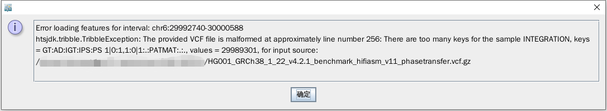

# GRCh38_HG001_SNP_Indel

Generate available small variant calls for HG001 (GRCh38) from GIAB.

## Objective

The Genome in a Bottle (GIAB) hosted by NIST is dedicated to the authoritative characterization of benchmark human genomes. However, the latest version (v4.2.1) variant calls (VCF) for HG001 (GRCh38) have improperly formatted records in the MHC region, which will cause a critical error in IGV visualization (see below) and pysam (see `jupyter.ipynb`).

In addition to this, v4.2.1 does not include variant calls for chrX, but v3.3.2 includes (see below), v4.2.1 contains more variant calls in autosomal chromosomes than v3.3.2 (see `jupyter.ipynb`). Therefore, we merged the autosomal variant calls from v4.2.1 and the chrX variant calls from v3.3.2 together to generate a more comprehensive variant calls for HG001.

    $ zcat data/HG001_GRCh38_1_22_v4.2.1_benchmark_hifiasm_v11_phasetransfer.vcf.gz | grep -v '#' | awk '{print $1}' | sort | uniq -c 
    307854 chr1
    198194 chr10
    197122 chr11
    186944 chr12
    155526 chr13
    124334 chr14
    113319 chr15
    117390 chr16
    101721 chr17
    116021 chr18
    85020 chr19
    325877 chr2
    82818 chr20
    54828 chr21
    49484 chr22
    269933 chr3
    293494 chr4
    250493 chr5
    263957 chr6
    220940 chr7
    210283 chr8
    167789 chr9

    $ zcat data/HG001_GRCh38_GIAB_highconf_CG-IllFB-IllGATKHC-Ion-10X-SOLID_CHROM1-X_v.3.3.2_highconf_PGandRTGphasetransfer.vcf.gz | grep -v '#' | awk '{print $1}' | sort | uniq -c
    295183 chr1
    188913 chr10
    190386 chr11
    169533 chr12
    148441 chr13
    123473 chr14
    105877 chr15
    66045 chr16
    93160 chr17
    89959 chr18
    72923 chr19
    291596 chr2
    79707 chr20
    52512 chr21
    42190 chr22
    263890 chr3
    232227 chr4
    222555 chr5
    245129 chr6
    205629 chr7
    178965 chr8
    161198 chr9
    99980 chrX

## Workflow

Firstly, we downloaded the v3.3.2 and v4.2.1 small variant files (VCF format) from GIAB (see `data/00_download.sh`).

Then, we merged small varants in `jupyter.ipynb`.

Please note that the value of PS was set to 0 if the original value is PATMAT, otherwise a digital value (compatible with `whatshap`). 

Outputs:

| File | Description |
| :-- | :-- |
| GRCh38_HG001_SNP_Indel.GIAB_v4.2.1_and_v3.3.2.bed.gz | Benchmark regions |
| GRCh38_HG001_SNP_Indel.GIAB_v4.2.1_and_v3.3.2.vcf.gz | Merged small variants without redundant information. FORMAT field only contain 'GT:IGT:IPS:PS' |
| GRCh38_HG001_SNP_Indel.GIAB_v4.2.1_and_v3.3.2_full.vcf.gz | Merged small variants with full information from GIAB VCF. |
